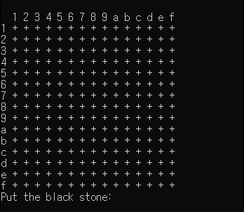

# C언어로 만든 오목 게임 (AI 플레이어 포함)

이 프로젝트는 C언어로 구현된 간단한 콘솔 기반의 오목(Goku) 게임입니다. 사용자는 기본적인 전략을 갖춘 AI를 상대로 플레이할 수 있습니다.

<p align="center"><br><em>제가 만든 알고리즘에 졌습니다ㅠ</em></p>

---

## 💻 버전별 개발 과정

이 오목 게임은 여러 버전을 거쳐 개발되었습니다. 아래 각 코드 파일의 상세 설명입니다.

### `Omok.c` (v1.0) - 기본 오목 게임 구현
* **주요 기능**:
    * 9x9 크기의 오목판 구현.
    * 두 명의 플레이어가 번갈아 가며 돌을 놓는 **순수 2인용** 게임 플레이.
    * 가로, 세로, 대각선 방향의 승리 판정 로직 포함.
* **특징**:
    * AI가 없는 가장 기본적인 오목 게임의 뼈대입니다.

---

### `Omok2.c` (v2.0) - 랜덤 AI 및 전략 함수 실험
* **주요 기능**:
    * 컴퓨터(백돌) 플레이어 추가.
    * AI의 실제 동작은 `CPUfirst` 함수를 통해 사용자가 놓은 돌 주변에 **랜덤**하게 착수합니다.
* **특징**:
    * **AI 로직 개발의 실험 단계**: 이 버전에는 실제 게임에 사용되지 않은 두 개의 함수가 포함되었습니다.
        * `CPUsecond`: 바둑판에서 가장 길게 연속된 돌을 찾는 **분석용 함수**입니다. (실제 AI 착수에는 미사용)
        * `CPUthird`: 특정 패턴(예: 돌 4개가 연속된 곳)을 찾아 방어하는 **전략 함수**로, 다음 버전 AI 로직의 기반이 됩니다. (실제 AI 착수에는 미사용)
    * 즉, v2.0의 AI는 **랜덤**으로만 동작하며, 더 지능적인 로직은 코드상에만 존재하고 아직 적용되지 않은 상태입니다.

---

### `Omok3.c` (v3.0) - 패턴 기반 전략 AI 적용
* **주요 기능**:
    * v2.0에서 실험했던 `CPUthird` 함수를 게임 로직에 **정식으로 적용**했습니다.
    * AI는 `len` 값을 5부터 줄여가며, 가장 긴 연속 패턴(승리 가능한 수, 또는 방어해야 할 수)을 우선적으로 찾아 대응합니다.
* **특징**:
    * 랜덤 AI에서 벗어나, **처음으로 전략적인 판단**을 하는 AI가 구현되었습니다.
    * 5목을 만들 수 있으면 공격하고, 상대의 4목을 막는 등 기본적인 공수 개념이 탑재되었습니다.

---

### `Omok4.c` (v4.0) - AI 알고리즘 고도화
* **주요 기능**:
    * `CPUthird` 함수의 로직을 개선하여 더 안정적인 수를 찾도록 코드를 다듬었습니다.
    * AI가 수를 결정하는 과정을 추적할 수 있도록 `printf` **디버깅 코드**를 추가했습니다.
    * 컴퓨터의 첫 수는 여전히 랜덤(`CPUfirst`)으로 두어, 매번 다른 게임 양상이 나타나도록 했습니다.
* **특징**:
    * v3.0의 핵심 로직은 유지하되, 코드의 안정성과 개발 편의성을 높이는 데 중점을 둔 버전입니다.

---

### `Omok5.c` (v5.0) - 정식 오목판 확장 및 UI 개선
* **주요 기능**:
    * 게임 보드 크기를 9x9에서 **15x15**로 확장하여 실제 오목 규칙에 맞게 변경했습니다.
    * 바둑돌 표시를 숫자(0, 1, 2)에서 문자(`+`, `B`, `W`)로 변경하여 가독성을 높였습니다.
    * 전략 AI 함수의 이름을 `CPUthird`에서 `CPUsecond`로 변경했습니다.
* **특징**:
    * 게임의 외형과 규칙이 좀 더 완성된 오목에 가까워졌습니다.
    * AI 알고리즘은 v4.0을 기반으로 하되, 확장된 보드 크기에 맞춰 동작합니다.

---

### `Omok6.c` (v6.0) - 최종 버전 (코드 정리 및 안정화)
* **주요 기능**:
    * v5.0의 로직을 기반으로 코드의 **주석을 상세히 보강**하고 변수명을 명확하게 하여 가독성을 높였습니다.
    * `CPUsecond` 함수의 로직을 다듬어 안정성을 개선하고 잠재적인 버그를 수정했습니다.
    * 게임 종료 시 `system("pause")`를 추가하여 사용자가 승리 메시지를 확인하고 프로그램을 종료할 수 있도록 했습니다. (Windows 환경)
* **특징**:
    * 현재 프로젝트의 **최종 안정화 버전**입니다.
    * 기능적으로는 v5.0과 거의 동일하지만, 코드의 완성도와 사용자 경험 측면에서 개선이 이루어졌습니다.

---

## 🎮 게임 방법

게임은 15x15 크기의 보드에서 진행됩니다. 가로, 세로, 또는 대각선으로 자신의 돌을 5개 먼저 연속으로 놓는 사람이 승리합니다.

* **플레이어 (흑돌):** 사용자입니다. 흑돌은 보드에 `B`로 표시됩니다.
* **컴퓨터 (백돌):** 인공지능(AI)입니다. 백돌은 보드에 `W`로 표시됩니다.

돌을 놓으려면, 원하는 위치의 좌표를 `x, y` 형식(예: `8, 8`)으로 입력하고 Enter 키를 누르세요.<br>
10 이상의 좌표는 보드에 a~f로 표시되어 있으나 편의상 숫자로 좌표를 입력하도록 만들었습니다. `a == 10`, `b == 11` ...

---

## 🛠️ 사전 준비

이 게임을 컴파일하고 실행하기 위해서는 C 컴파일러가 필요합니다. 가장 널리 사용되는 것은 **GCC (GNU Compiler Collection)** 입니다.

### Windows
[MinGW-w64](https://www.mingw-w64.org/) 또는 [MSYS2](https://www.msys2.org/)를 통해 GCC를 설치할 수 있습니다.

### macOS
터미널에 다음 명령어를 입력하여 Xcode 커맨드 라인 도구를 설치하세요. 이 도구에는 C 컴파일러(Clang)가 포함되어 있습니다.
```bash
xcode-select --install
```

### Linux

대부분의 Linux 배포판에는 GCC가 기본적으로 설치되어 있습니다. 만약 설치되어 있지 않다면, 배포판의 패키지 관리자를 사용하여 설치할 수 있습니다. (예: Debian/Ubuntu 기반 시스템)

```bash
sudo apt-get update
sudo apt-get install build-essential
```
---

## ⚙️ 컴파일 및 실행 방법

아래 단계에 따라 게임을 시작할 수 있습니다.

- `Omok6.c` 파일이 최종 완성된 파일입니다.
1.  **소스 코드 다운로드**
    이 저장소를 클론하거나 `Omok6.c` 파일을 컴퓨터에 다운로드합니다.

2.  **터미널 열기**
    `Omok6.c` 파일이 저장된 디렉토리로 이동합니다.

3.  **코드 컴파일**
    다음 명령어를 사용하여 소스 코드를 컴파일합니다. 이 과정을 통해 실행 파일이 생성됩니다.
    ```bash
    gcc Omok6.c -o omok
    ```
    * `gcc`: 컴파일러를 실행하는 명령어입니다.
    * `Omok6.c`: 컴파일할 소스 코드 파일입니다.
    * `-o omok`: 생성될 실행 파일의 이름을 `omok`으로 지정합니다.

4.  **게임 실행**
    컴파일이 완료되면 아래 명령어로 게임을 실행하세요.

    * **Windows:**
        ```bash
        omok
        ```
    * **macOS 또는 Linux:**
        ```bash
        ./omok
        ```

이제 터미널에 오목판이 나타나고 게임을 시작할 수 있습니다. 즐겁게 플레이하세요!
